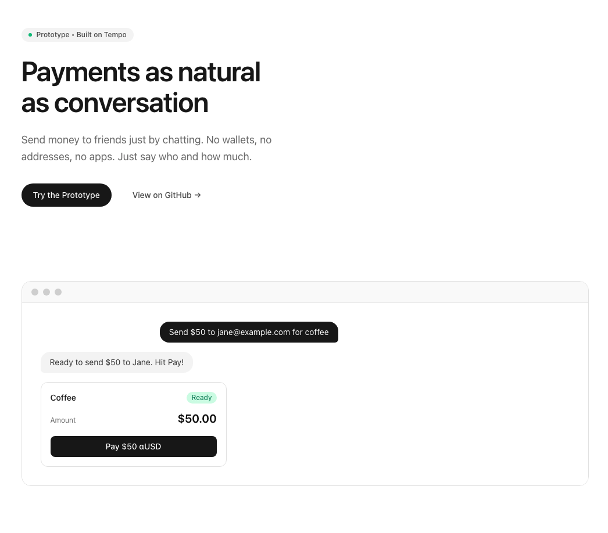

# Aria

**AI-powered group treasury for splitting expenses with natural language.**

Built for the Tempo × Privy Hackathon.



---

## What is Aria?

Aria is a conversational interface for managing shared finances. Instead of clicking through forms and buttons, you just talk:

- "Create a group called Roommates"
- "Add 0x123... to the group"
- "Split $120 for utilities"
- "Pay this split"

Aria understands your intent, executes the logic, and renders interactive UI components—all powered by AI.

---

## Features

| Feature | Description |
|---------|-------------|
| **Natural Language** | No forms. Just describe what you want. |
| **Instant Wallets** | Sign in with email. Privy creates a wallet automatically. |
| **Group Treasury** | Create groups and manage shared expenses together. |
| **Smart Splits** | AI calculates per-person amounts automatically. |
| **On-chain Payments** | One-click batch payments with memos on Tempo. |
| **Generative UI** | AI renders interactive cards, not just text responses. |

---

## Demo Flow
```
You: What's my balance?
Aria: [renders BalanceCard showing 1,000.00 αUSD]

You: Create a group called Roommates
Aria: [renders GroupCard with you as the first member]

You: Add 0x1234...7890 to the group
Aria: [renders updated GroupCard with 2 members]

You: Split $60 for dinner
Aria: [renders SplitCard showing $30 per person]

You: Pay this split
Aria: [renders PaymentCard with "Pay $30" button]
     → Click → Transaction sent on-chain ✓
```

---

## Tech Stack

| Layer | Technology |
|-------|------------|
| **AI Chat** | [Tambo](https://tambo.co) — Generative UI framework |
| **Wallet Auth** | [Privy](https://privy.io) — Email → embedded wallet |
| **Blockchain** | [Tempo](https://tempo.xyz) — L2 with native memos |
| **Frontend** | Next.js 15, React 19, TypeScript |
| **Styling** | Tailwind CSS |

---

## Architecture
```
┌─────────────────────────────────────────────────────┐
│                    Frontend                         │
│  ┌───────────┐  ┌───────────┐  ┌───────────────┐   │
│  │  Next.js  │  │  Tambo    │  │    Privy      │   │
│  │   App     │──│  Provider │──│   Provider    │   │
│  └───────────┘  └───────────┘  └───────────────┘   │
│         │              │               │            │
│         ▼              ▼               ▼            │
│  ┌───────────┐  ┌───────────┐  ┌───────────────┐   │
│  │   Chat    │  │   Tools   │  │   Embedded    │   │
│  │    UI     │  │ & Actions │  │    Wallet     │   │
│  └───────────┘  └───────────┘  └───────────────┘   │
└─────────────────────────────────────────────────────┘
                         │
                         ▼
┌─────────────────────────────────────────────────────┐
│              Tempo Blockchain                       │
│  ┌───────────────────────────────────────────────┐ │
│  │  αUSD Token (TIP-20 with memo support)        │ │
│  │  - transferWithMemo(to, amount, memo)         │ │
│  │  - Gas paid in αUSD (no native token needed)  │ │
│  └───────────────────────────────────────────────┘ │
└─────────────────────────────────────────────────────┘
```

---

## Generative UI Components

Aria uses Tambo to render interactive components based on context:

| Component | Triggered By | Description |
|-----------|--------------|-------------|
| `BalanceCard` | "What's my balance?" | Shows wallet balance with token info |
| `GroupCard` | "Create a group..." | Displays group with member avatars |
| `SplitCard` | "Split $X for..." | Shows expense breakdown |
| `PaymentCard` | "Pay this split" | Confirms and executes payment |

The AI decides which component to render based on the conversation.

---

## Tools (AI Actions)

| Tool | Description |
|------|-------------|
| `getBalance` | Query αUSD balance for any address |
| `createGroup` | Create a new group treasury |
| `addMember` | Add a wallet address to a group |
| `createSplit` | Split an expense among group members |
| `buildBatchPayment` | Prepare batch payment transactions |
| `listGroups` | List all groups for a user |

---

## Getting Started

### Prerequisites

- Node.js 20+
- npm or yarn

### Installation
```bash
# Clone the repo
git clone https://github.com/yourusername/aria.git
cd aria

# Install dependencies
npm install

# Set up environment variables
cp .env.example .env.local
```

### Environment Variables
```env
NEXT_PUBLIC_TAMBO_API_KEY=your_tambo_api_key
NEXT_PUBLIC_PRIVY_APP_ID=your_privy_app_id
```

### Run Development Server
```bash
npm run dev
```

Open [http://localhost:3000](http://localhost:3000)

### Fund Your Wallet

After logging in, fund your Privy wallet with testnet αUSD:
```bash
curl -X POST https://rpc.moderato.tempo.xyz \
  -H "Content-Type: application/json" \
  -d '{"jsonrpc":"2.0","method":"tempo_fundAddress","params":["YOUR_WALLET_ADDRESS"],"id":1}'
```

---

## Project Structure
```
src/
├── app/
│   ├── page.tsx          # Landing page
│   └── chat/
│       └── page.tsx      # Chat interface
├── components/
│   ├── BalanceCard.tsx   # Balance display component
│   ├── GroupCard.tsx     # Group display component
│   ├── SplitCard.tsx     # Split display component
│   ├── PaymentCard.tsx   # Payment execution component
│   ├── WalletButton.tsx  # Wallet connect/display
│   └── ChatWrapper.tsx   # Main chat container
├── lib/
│   ├── tambo.ts          # Tambo tools & components config
│   ├── aria-tools.ts     # Tool implementations
│   └── tempo.ts          # Chain config & ABIs
└── providers/
    └── Providers.tsx     # Privy + Wagmi providers
```

---

## Key Innovations

### 1. Conversational Finance
Traditional expense-splitting apps require navigating menus and filling forms. Aria replaces all of that with natural conversation.

### 2. Generative UI
Instead of returning plain text, the AI renders rich, interactive components. The user sees cards they can click, not instructions to follow.

### 3. Seamless Wallets
Users sign in with email—no seed phrases, no extensions. Privy creates an embedded wallet instantly. Blockchain complexity is completely hidden.

### 4. Memos On-Chain
Every payment includes a memo stored on-chain via Tempo's TIP-20 standard. "Dinner at Nobu" isn't just a note—it's immutable transaction history.

---

## Future Improvements

- [ ] Request payments (reverse flow)
- [ ] Transaction history view
- [ ] Multi-token support (αUSD + βUSD)
- [ ] ENS / Tempo name resolution
- [ ] Recurring splits
- [ ] Mobile app

---

## Team

Built by Daniel Ukaji for the Tempo × Privy Virtual Hackathon.

---

## License

MIT